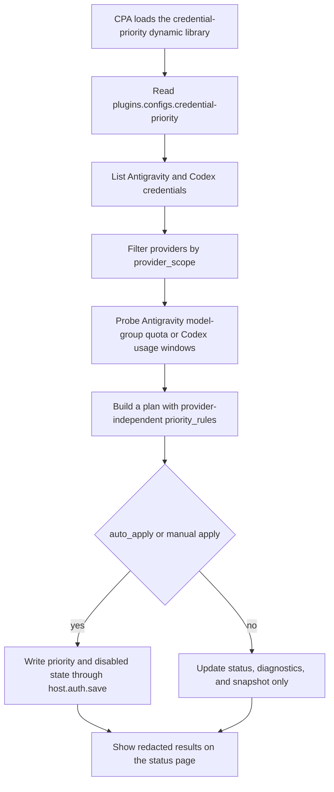

# credential-priority

Credential Priority is a CLIProxyAPI (CPA) plugin that automatically adjusts credential priority. The plugin ID, dynamic library basename, and CPA configuration key are all `credential-priority`.

## Navigation

- [Chinese README](./README.md)
- [Overview](#overview)
- [Workflow](#workflow)
- [Build and Installation](#build-and-installation)
- [Configuration](#configuration)
- [Management Page and API](#management-page-and-api)
- [Plugin Store Publishing Format](#plugin-store-publishing-format)
- [Security Rules](#security-rules)

## Overview

- Reuses CPA credential, proxy, and write-back flows through `host.auth.list`, `host.auth.get`, `host.auth.get_runtime`, and `host.auth.save`.
- Generates priority changes only from fresh and ready evidence collected in the current run.
- Currently supports only Antigravity and Codex credentials; additional providers may be added later.
- Provider rules are independent: Antigravity and Codex do not share start priorities or depletion behavior.
- Status pages, diagnostics, snapshots, and logs expose only redacted credential information.

## Workflow



## Build and Installation

The plugin runs as a CGO dynamic library. CPA derives the plugin ID from the dynamic library filename, so the filename must stay `credential-priority.<ext>`.

```bash
go build -buildmode=c-shared -o credential-priority.so .
```

Place the artifact in one of the CPA plugin discovery directories:

- `plugins/<GOOS>/<GOARCH>/credential-priority.<ext>`
- `plugins/<GOOS>/<GOARCH>-<variant>/credential-priority.<ext>`
- `plugins/credential-priority.<ext>`

Extensions: `.so` on Linux and FreeBSD, `.dylib` on macOS, and `.dll` on Windows.

## Configuration

Enable the CPA plugin system and keep plugin-owned fields under `plugins.configs.credential-priority`:

```yaml
plugins:
  enabled: true
  dir: "plugins"
  configs:
    credential-priority:
      enabled: true
      priority: 10
      auto_apply: false
      provider_scope: "all"
      selected_providers: []
      antigravity_model_group: "gemini"
      interval: 5m
      max_concurrency: 2
      min_change: 1
      top_priority_probe_count: 10
      active_group_size: 10
      active_group_jitter: 10m
      disabled_group_size: 5
      disabled_probe_interval: 30m
      cache_ttl: 15m
      cache_path: "credential-priority/refresh-cache.json"
      priority_rules:
        enabled: false
        antigravity:
          start_priority: 100
        codex:
          start_priority: 100
          free_depleted_priority: -1
          free_depleted_disabled: true
          paid_depleted_keeps_enabled: true
```

| Field | Description |
| :--- | :--- |
| `enabled` | Per-plugin switch. Global `plugins.enabled: true` and successful dynamic library registration are also required. |
| `priority` | CPA plugin loading and execution order. Higher values run earlier. |
| `auto_apply` | Enables scheduled execution and write-back. Default: `false`. |
| `provider_scope` | `all` handles all currently supported providers; `selected` handles only `selected_providers`. |
| `selected_providers` | Supports only `antigravity` and `codex`. Empty selected scope falls back to `all`. |
| `antigravity_model_group` | Antigravity quota group: `gemini` or `claude_gpt`. |
| `interval` | Scheduled execution interval. Default: `5m`. |
| `max_concurrency` | Concurrent probe count. Default: `2`. |
| `min_change` | Priority changes below this threshold are skipped. Default: `1`. |
| `top_priority_probe_count` | Number of high-priority credentials probed immediately. Default: `10`. |
| `active_group_size` | Active credential probe group size. Default: `10`. |
| `active_group_jitter` | Active group probe jitter. Default: `10m`. |
| `disabled_group_size` | Disabled credential probe group size. Default: `5`. |
| `disabled_probe_interval` | Disabled credential re-probe interval. Default: `30m`. |
| `cache_ttl` | Probe cache TTL. Default: `15m`. |
| `cache_path` | Probe cache path. Default: `credential-priority/refresh-cache.json`. |
| `priority_rules.enabled` | Enables custom priority rules. When disabled, built-in sorting is used. |

### Provider-Independent Rules

Antigravity rules affect only Antigravity credentials:

- `priority_rules.antigravity.start_priority`: start priority for available credentials. Default: `100`.
- Only credentials with fresh quota evidence for the selected Antigravity model group are sorted.
- Failed quota fetches and unavailable remaining quota keep the current priority and enabled state.

Codex rules affect only Codex credentials:

- `priority_rules.codex.start_priority`: start priority for available credentials. Default: `100`.
- `priority_rules.codex.free_depleted_priority`: priority for depleted Free credentials. Default: `-1`.
- `priority_rules.codex.free_depleted_disabled`: disables depleted Free credentials. Default: `true`.
- `priority_rules.codex.paid_depleted_keeps_enabled`: keeps Plus, Pro, and Team credentials enabled when depleted. Default: `true`.

## Management Page and API

The plugin registers a resource page and management routes through `management.register`.

### Resource Page

- `GET /v0/resource/plugins/credential-priority/status`
  Returns an HTML dashboard with credential totals, provider counts, next probe time, recent audit summary, and redacted decisions.

### Management API

The following endpoints require the CPA management key:

- `POST /v0/management/plugins/credential-priority/run?mode=apply&provider_scope=all&antigravity_model_group=gemini`
  Manually probes, plans, and writes credential changes.
- `POST /v0/management/plugins/credential-priority/run?mode=apply&provider=antigravity&antigravity_model_group=claude_gpt`
  Handles only Antigravity credentials with the Claude/GPT model group.
- `POST /v0/management/plugins/credential-priority/run?mode=apply&provider=codex`
  Handles only Codex credentials.
- `GET /v0/management/plugins/credential-priority/diagnostics`
  Exports redacted diagnostics.
- `GET /v0/management/plugins/credential-priority/snapshot/latest`
  Returns the latest redacted decision snapshot.

## Plugin Store Publishing Format

The plugin store registry points to a GitHub repository. The actual installation version comes from the latest GitHub release tag. This repository publishes `v1.0.0` and provides `registry.json` at the repository root as a third-party store source example.

Registry example:

```json
{
  "schema_version": 1,
  "plugins": [
    {
      "id": "credential-priority",
      "name": "Credential Priority",
      "description": "Automatically sorts Antigravity and Codex credentials by fresh quota evidence.",
      "author": "Cody292",
      "version": "1.0.0",
      "repository": "https://github.com/Cody292/credential-priority",
      "tags": ["credential", "management"]
    }
  ]
}
```

The `v1.0.0` release must include:

- `credential-priority_1.0.0_<goos>_<goarch>.zip`
- `checksums.txt`

The zip root must directly contain the dynamic library, for example on Linux:

```text
credential-priority.so
```

`checksums.txt` uses the standard sha256 format:

```text
<sha256>  credential-priority_1.0.0_linux_amd64.zip
```

## Security Rules

- Never print secrets, tokens, Authorization headers, or raw credential JSON in logs, status pages, diagnostics, or snapshots.
- Plugin HTTP requests should use `host.http.*` to preserve CPA proxy, logging, and transport behavior.
- Credential reads and writes must go through `host.auth.*` callbacks instead of duplicating CPA credential file management.
- The public release repository must not contain local planning documents, management keys, caches, build artifacts, tests, or test data.
