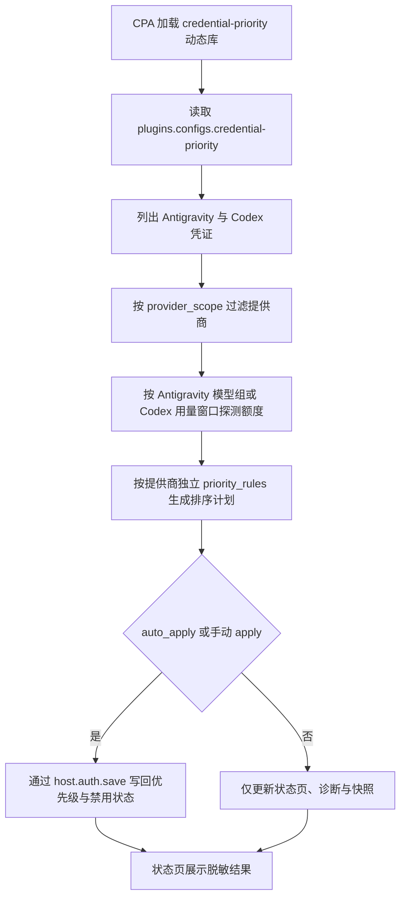

# credential-priority

CLIProxyAPI（CPA）凭证优先级自动调整插件。插件 ID、动态库 basename 与 CPA 配置键均为 `credential-priority`。

## 导航

- [英文 README](./README.en.md)
- [功能概览](#功能概览)
- [工作流程](#工作流程)
- [构建与安装](#构建与安装)
- [配置说明](#配置说明)
- [管理页面与接口](#管理页面与接口)
- [插件商店发布格式](#插件商店发布格式)
- [安全约束](#安全约束)

## 功能概览

- 通过宿主回调 `host.auth.list`、`host.auth.get`、`host.auth.get_runtime`、`host.auth.save` 复用 CPA 的凭证、代理和写入链路。
- 只对本轮最新且可用的探测证据生成排序变更，避免用过期缓存调整凭证状态。
- 当前仅支持 Antigravity 与 Codex 凭证；后续可扩展其他提供商配置。
- 不同提供商的排序规则彼此独立，Antigravity 与 Codex 不共享起始优先级或额度耗尽策略。
- 状态页、诊断、快照与日志只输出脱敏后的凭证信息。

## 工作流程



## 构建与安装

插件以 CGO 动态库形式运行，宿主会从动态库文件名去掉扩展名得到插件 ID，因此文件名必须保持为 `credential-priority.<ext>`。

```bash
go build -buildmode=c-shared -o credential-priority.so .
```

把产物放入 CPA 插件发现目录之一：

- `plugins/<GOOS>/<GOARCH>/credential-priority.<ext>`
- `plugins/<GOOS>/<GOARCH>-<variant>/credential-priority.<ext>`
- `plugins/credential-priority.<ext>`

扩展名：Linux/FreeBSD 为 `.so`，macOS 为 `.dylib`，Windows 为 `.dll`。

## 配置说明

在 CPA `config.yaml` 中启用插件系统，并在 `plugins.configs.credential-priority` 下保留插件自有配置：

```yaml
plugins:
  enabled: true
  dir: "plugins"
  configs:
    credential-priority:
      enabled: true
      priority: 10
      auto_apply: false
      provider_scope: "all"
      selected_providers: []
      antigravity_model_group: "gemini"
      interval: 5m
      max_concurrency: 2
      min_change: 1
      top_priority_probe_count: 10
      active_group_size: 10
      active_group_jitter: 10m
      disabled_group_size: 5
      disabled_probe_interval: 30m
      cache_ttl: 15m
      cache_path: "credential-priority/refresh-cache.json"
      priority_rules:
        enabled: false
        antigravity:
          start_priority: 100
        codex:
          start_priority: 100
          free_depleted_priority: -1
          free_depleted_disabled: true
          paid_depleted_keeps_enabled: true
```

字段说明：

| 字段 | 说明 |
| :--- | :--- |
| `enabled` | 单插件开关；还需要全局 `plugins.enabled: true` 且动态库注册成功。 |
| `priority` | CPA 宿主加载与执行插件的顺序，数值越大优先级越高。 |
| `auto_apply` | 是否由定时器自动执行并写回排序结果，默认 `false`。 |
| `provider_scope` | `all` 表示处理全部当前支持的提供商；`selected` 表示只处理 `selected_providers`。 |
| `selected_providers` | 仅支持 `antigravity` 与 `codex`；为空且 `provider_scope: selected` 时会回退为 `all`。 |
| `antigravity_model_group` | Antigravity 配额模型组，支持 `gemini` 与 `claude_gpt`。 |
| `interval` | 自动执行间隔，默认 `5m`。 |
| `max_concurrency` | 并发探测数，默认 `2`。 |
| `min_change` | 低于该差值的优先级变化不写回，默认 `1`。 |
| `top_priority_probe_count` | 高优先级凭证立即探测数量，默认 `10`。 |
| `active_group_size` | 启用凭证分组探测数量，默认 `10`。 |
| `active_group_jitter` | 启用凭证分组探测抖动，默认 `10m`。 |
| `disabled_group_size` | 禁用凭证分组探测数量，默认 `5`。 |
| `disabled_probe_interval` | 禁用凭证重新探测间隔，默认 `30m`。 |
| `cache_ttl` | 探测缓存有效期，默认 `15m`。 |
| `cache_path` | 探测缓存文件路径，默认 `credential-priority/refresh-cache.json`。 |
| `priority_rules.enabled` | 是否启用自定义排序规则；关闭时使用内置排序策略。 |

### 提供商独立排序规则

Antigravity 规则只影响 Antigravity 凭证：

- `priority_rules.antigravity.start_priority`：可用凭证的起始优先级，默认 `100`。
- 只排序本轮成功获取到所选模型组配额的 Antigravity 凭证。
- 配额获取失败或剩余额度不可用时保留当前优先级与启用状态。

Codex 规则只影响 Codex 凭证：

- `priority_rules.codex.start_priority`：可用凭证的起始优先级，默认 `100`。
- `priority_rules.codex.free_depleted_priority`：Free 凭证额度为 0 时写入的优先级，默认 `-1`。
- `priority_rules.codex.free_depleted_disabled`：Free 凭证额度为 0 时是否禁用，默认 `true`。
- `priority_rules.codex.paid_depleted_keeps_enabled`：Plus、Pro、Team 额度耗尽时是否保持启用，默认 `true`。

## 管理页面与接口

插件通过 `management.register` 注册资源页面和管理路由。

### 资源页面

- `GET /v0/resource/plugins/credential-priority/status`
  返回 HTML 看板，展示凭证总数、提供商数量、下一次探测时间、最近审计摘要和脱敏决策结果。

### 管理 API

以下接口需要 CPA 管理密钥：

- `POST /v0/management/plugins/credential-priority/run?mode=apply&provider_scope=all&antigravity_model_group=gemini`
  手动触发探测、规划并写入凭证。
- `POST /v0/management/plugins/credential-priority/run?mode=apply&provider=antigravity&antigravity_model_group=claude_gpt`
  只处理 Antigravity 凭证并使用 Claude/GPT 模型组。
- `POST /v0/management/plugins/credential-priority/run?mode=apply&provider=codex`
  只处理 Codex 凭证。
- `GET /v0/management/plugins/credential-priority/diagnostics`
  导出脱敏诊断信息。
- `GET /v0/management/plugins/credential-priority/snapshot/latest`
  获取最近一次运行的脱敏决策快照。

## 插件商店发布格式

插件商店 registry 需要指向 GitHub 仓库，实际安装版本来自 GitHub latest release tag；本仓库发布版本为 `v1.0.0`，并在根目录提供 `registry.json` 作为第三方商店来源示例。

registry 示例：

```json
{
  "schema_version": 1,
  "plugins": [
    {
      "id": "credential-priority",
      "name": "Credential Priority",
      "description": "Automatically sorts Antigravity and Codex credentials by fresh quota evidence.",
      "author": "Cody292",
      "version": "1.0.0",
      "repository": "https://github.com/Cody292/credential-priority",
      "tags": ["credential", "management"]
    }
  ]
}
```

`v1.0.0` Release 资产必须包含：

- `credential-priority_1.0.0_<goos>_<goarch>.zip`
- `checksums.txt`

zip 根目录必须直接包含动态库，例如 Linux：

```text
credential-priority.so
```

`checksums.txt` 使用 sha256 标准格式：

```text
<sha256>  credential-priority_1.0.0_linux_amd64.zip
```

## 安全约束

- 不要在日志、状态页、诊断或快照中输出密钥、Token、Authorization 头或原始凭证 JSON。
- 插件自己的 HTTP 请求优先走 `host.http.*`，避免绕过宿主代理、日志和传输策略。
- 凭证读取与写入必须通过 `host.auth.*` 回调完成，避免复制宿主凭证文件管理逻辑。
- 当前公开发布仓库不应包含本地规划文档、管理密钥、缓存、构建产物、测试文件或测试数据。
